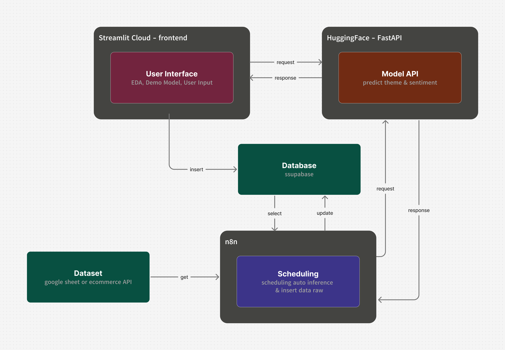

# Topic Pulse — Analisis Tema Ulasan Produk Tokopedia Berbahasa Indonesia

Proyek ini mengubah ulasan produk Tokopedia yang masih mentah menjadi informasi yang lebih terstruktur dan mudah dieksplorasi. Daripada hanya menampilkan skor sentimen positif atau negatif, setiap ulasan dikelompokkan ke dalam tema atau topik tertentu (misalnya kemasan, pengiriman cepat, penjual yang kurang responsif, atau barang yang tidak sesuai deskripsi) yang ditemukan secara otomatis menggunakan teknik topic modeling.


---

## Team

| Name | Role | Job Description |
|---|---|---|
| Fauzi Maulana | Data Analyst | Exploratory Data Analysis, dashboard insight |
| Derida Falahian | Data Engineer | Arsitektur deployment, integrasi FastAPI–Streamlit, Database, CI/CD, Automation |
| Dafa Hutapea | Data Scientist | Preprocessing teks, training model BERTopic, evaluasi model, interpretasi tema & sentimen |

---

## Features

- **Methodology** — penjelasan alur kerja model dari awal hingga akhir
- **EDA Dashboard** — visualisasi interaktif tema, emosi, rating, harga, dan sebaran geografis
- **Predict Theme** — prediksi tema dari teks ulasan baru secara real-time
- **Submit a Review** — input ulasan baru yang otomatis diberi tema saat masuk ke database

---

## Architecture
  

**Alur singkat:**
1. **User-facing flow** — Streamlit (frontend) menerima input user (baca dashboard, submit review, minta prediksi tema), lalu memanggil FastAPI untuk inference dan Supabase untuk baca/tulis data.
2. **Automation flow (n8n)** — dua workflow berjalan independen dari aplikasi utama:
   - **Auto Inference Scheduler** — berjalan terjadwal (misal tiap X jam), mengambil review yang belum punya tema dari database, mengirimkannya ke FastAPI `/infer`, lalu menulis hasil tema kembali ke Supabase.
   - **Auto Insert Data to DB** — mengambil data review baru dari sumber eksternal dan memasukkannya ke Supabase secara otomatis, tanpa perlu input manual lewat Streamlit.

Kedua workflow ini memisahkan proses **batch/background** dari proses **real-time** yang dilayani FastAPI dan Streamlit — sehingga aplikasi utama tetap ringan dan tidak perlu menangani job terjadwal sendiri.

---

## Workflow Automation (n8n)

| Workflow | Trigger | Fungsi |
|---|---|---|
| **Auto Inference** | Schedule (Cron) | Ambil review baru yang belum memiliki tema dari Supabase → kirim ke FastAPI `/infer` → simpan hasil prediksi tema kembali ke Supabase |
| **Auto Insert Data to DB** | Schedule (Cron) | Ambil data review baru dari sumber eksternal → insert ke tabel Supabase agar tersedia untuk proses inference dan ditampilkan di dashboard |

> File export workflow n8n (`.json`) disimpan di folder [`n8n/`](./n8n) agar dapat di-import ulang ke instance n8n mana pun.

---

## Tech Stack

- **Modeling**: Python, BERTopic (BERT-based topic modeling), Sentence Transformers
- **Frontend**: Streamlit
- **Backend**: FastAPI (inference service)
- **Database**: PostgreSQL (Supabase)
- **Automation**: n8n (scheduled inference & auto data ingestion workflows)
- **Deployment**: Streamlit Community Cloud (frontend), Hugging Face Spaces (FastAPI inference API)

---

## Project Structure

```
havktiv8-final-project/
├── fastpi/                       # FastAPI inference service
│   ├── app.py
│   ├── utils/
│   ├── artifacts/
│   ├── requirements.txt
│   └── Dockerfile
├── modeling/                     # Streamlit frontend
├── streamlit/                    # Streamlit frontend
│   └── src/
│       ├── app.py
│       ├── eda.py
│       ├── methodology.py
│       ├── prediction.py
│       ├── utils/
│       ├── requirements.txt
│       └── .streamlit/
│           └── secrets.toml      # (local only)
├── n8n/                          # exported n8n workflow definitions
│   ├── inference-scheduler.json
│   ├── insert-data-scheduler.json
│   ├── inference-scheduler.png
│   └── insert-data-scheduler.png
└── README.md
```

---

## Running Locally

### Prerequisites

- Python 3.11+
- Git
- Akun Supabase (untuk database) — opsional jika hanya menjalankan frontend

### 1. Clone repository

```bash
git clone https://github.com/Derida21/havktiv8-final-project.git
cd havktiv8-final-project
```
### 2. Setup Streamlit (frontend)

Buka terminal baru:

```bash
cd streamlit
mkdir .streamlit
cd .streamlit
notepad secret.toml

cd ../..
docker compose up -d
```

Buat folder `.streamlit/`, lalu buat file `.streamlit/secrets.toml`:

```toml
API_URL = "http://usernameHF-namaspace.hf.space/infer"
INFERENCE_API_KEY = "set up private di HuggingFace"

[connections.supabase]
dialect = "postgresql"
host = "your-supabase-host"
port = 5432
database = "postgres"
username = "your-username"
password = "your-password"
```

> ⚠️ File `secrets.toml` berisi kredensial rahasia — pastikan sudah masuk `.gitignore` dan **tidak pernah** di-commit ke repository.

Buka di `http://localhost:8501` di browser.

---

## Environment Variables Summary

| Variable | Digunakan di | Keterangan |
|---|---|---|
| `INFERENCE_API_KEY` | FastAPI & Streamlit | Harus identik di kedua sisi untuk otentikasi request |
| `API_URL` | Streamlit | URL FastAPI (local: `http://localhost:8000`, production: URL Hugging Face Spaces) |
| `connections.supabase.*` | Streamlit | Kredensial koneksi database Supabase |

---

## Deployment

- **FastAPI**: di-deploy ke [Hugging Face Spaces](https://huggingface.co/spaces/scoorpion21/fastpi) menggunakan Docker
- **Streamlit**: di-deploy ke [Streamlit Community Cloud](https://tokopedia-sentiment-review.streamlit.app/), dengan main file path `streamlit/src/app.py`
- **n8n**: menggunakan service dari third-party

Secrets untuk masing-masing platform diisi lewat dashboard platform tersebut:  
- Hugging Face Spaces → Settings → Secrets  
- Streamlit Cloud → App Settings → Secrets, bukan lewat file yang di-commit.